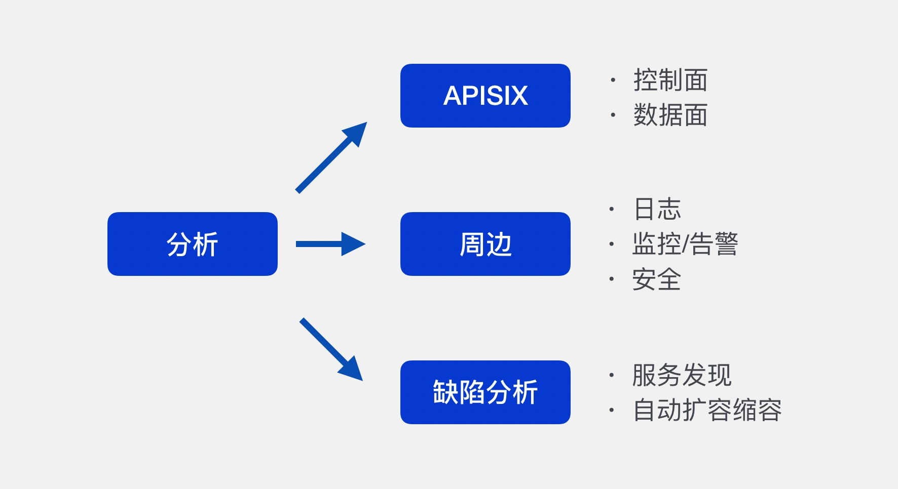
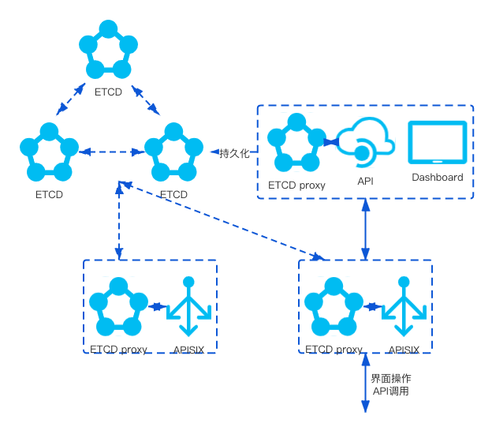
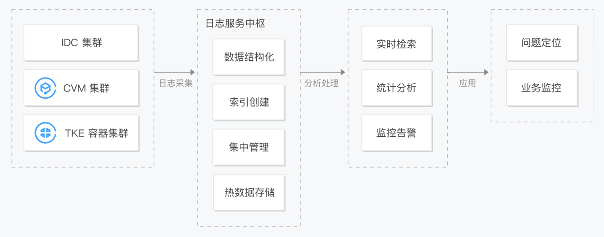
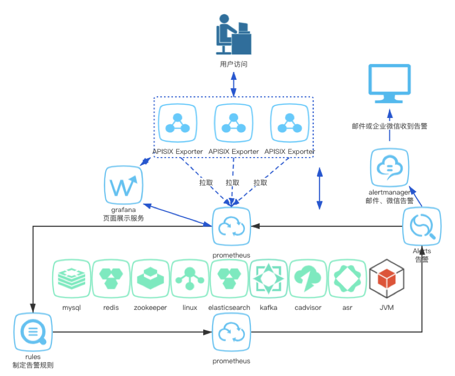
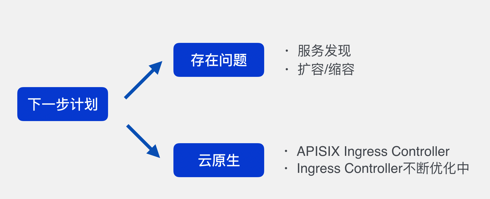

# 开箱即用 -- Apache APISIX 公有云高可用架构

Apache APISIX 作为 API 网关，往往会作为企业的边缘网关，承载绝大部分的南北向流量。运维常说5个'9'、4个'9'、3个'9'可靠性，对于边缘网关的可靠性要求往往要达到5个'9'，因为边缘网关对于内部服务的可用性至关重要，一旦边缘网关不可用，整个内部服务全都会受到影响。

> 什么是高可用？高可用 HA（High Availability）是分布式系统架构设计中必须考虑的因素之一，它通常是指，通过设计减少系统不能提供服务的时间。如果一个系统能够一直提供服务，那么这个可用性则是百分之百，但是天有不测风云。所以我们只能尽可能的去减少服务的故障。

## 写这篇文章的目的

1. 边缘网关地位至关重要，要有足够的稳定性（高可用）。APISIX 在生产环境中往往会作为边缘网关，作为整个内部服务的流量入口，牵一发而动全身，一旦边缘网关不可用，整个内部服务全都会受到影响。

2. 架构级高可用要有一定基础。设计边缘网关的高可用架构有一定门槛，不仅需要熟悉 Nginx、Apache APISIX 等边缘网关，还要有一定的高可用架构基础。

3. 缺少 Apache APISIX 高可用架构的分享。当前通过 baidu 或者 google 相关 APISIX 搜索结果往往是一些 APISIX 的入门使用，另一方面，核心维护者的几次宣讲主要也是从实现层面讲述 Apache APISIX 如何实现极高的转发性能（比如王院生的《 APISIX 高性能实践 》）。

## 公有云高可用架构

那么，如何设计公有云的高可用架构呢？

大多数人第一个想到会是 APISIX 数据面如何高可用。意识很好，但是不够，仅仅是数据面的高可用是不够的，因为控制面的路由配置和数据面的路由转发是相辅相成的，而且如果没有想清楚如何管理 API，如何保证 API 的正确性和一致性，在后续运维和使用的过程中，也会因为操作不当或者节点故障导致路由配置异常，影响数据面的路由转发，所以控制面关于路由规则的高可用也是需要考虑的。

那么这样就可以高枕无忧了吗？如果一旦请求出错如何去定位问题呢？千里之堤溃于蚁穴，在网关的小故障演变为大故障之前，如何提前发现网关的故障？网关往往会存储一些关键的用户信息或者证书信息，又如何保证其安全性呢？

所以，在 APISIX 本身高可用之外，也需要从日志和日志处理、监控和告警以及安全的角度分析如何实现基于公有云的边缘网关的高可用架构。

当然，开源的网关往往不是完美的，我们会在后面的剖析如何实现边缘网关的高可用架构的时候，发现当前 Apache APISIX 的一些缺点，比如不支持服务发现，也没有周边工具支持自动扩容缩容等问题，这个我会在最后简单说一下自己的看法以及解决办法。

### 数据面高可用（路由转发）

### 控制面高可用（路由配置）

### 日志和日志处理

### 监控和告警

### 安全

## 展望

